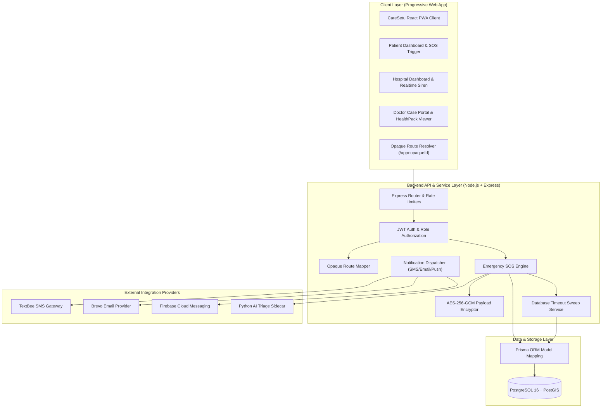
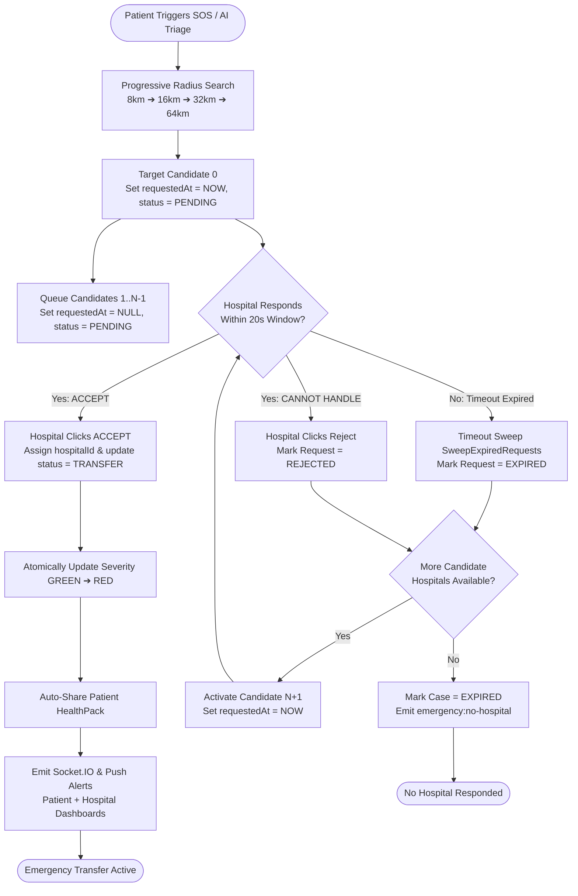
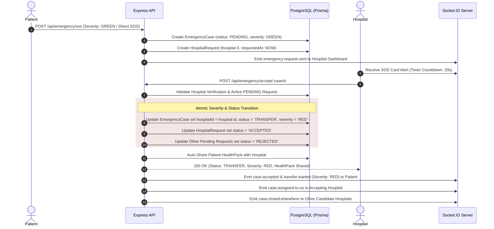
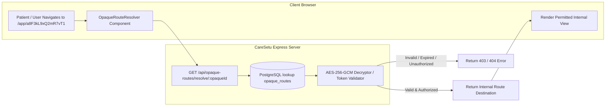
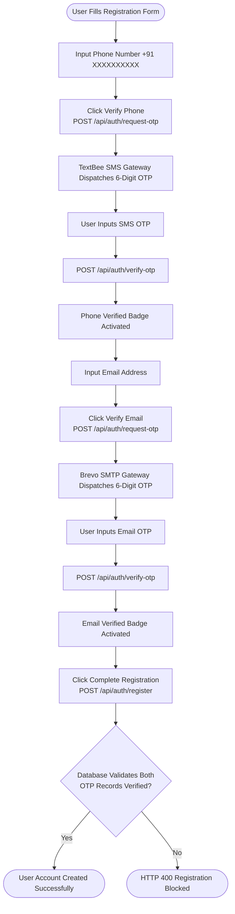

# CareSetu — AI-Integrated Healthcare & Emergency Response Platform

<p align="center">
  
  
  
  
  
  
  
</p>

---

## 🌟 Overview

**CareSetu** is an end-to-end, AI-integrated healthcare coordination and emergency response platform designed to save lives by connecting patients to the right healthcare facilities at the right time.

CareSetu bridges the gap between emergency triage, location-aware progressive hospital matching, encrypted medical records (HealthPacks), real-time response dashboards, and offline emergency continuity.

---

## 🏗️ System Architecture & Data Flow

### 1. High-Level Multi-Tier Architecture



---

## 🔄 System Flowcharts & Lifecycles

### 🚨 2. Emergency SOS Timeout & Hospital Reassignment Flowchart



---

### 🛡️ 3. Direct SOS Acceptance & Severity Escalation (GREEN ➔ RED) Flowchart



---

### 🔑 4. ChatGPT-Style Opaque URL & AES-256-GCM Encryption Flowchart



---

### 📱 5. Dual OTP (SMS & Email 2FA) Registration Verification Flowchart



---

## 🚀 Key Features & Architectural Capabilities

### 🆘 Emergency SOS & Intelligent Hospital Routing
* **Direct SOS & AI Triage**: One-click Emergency SOS activation with GPS coordinate transmission and AI-assisted symptom triage.
* **Progressive Radius Search**: Automatically expands hospital search radius progressively (8km → 16km → 32km → 64km) based on real-time availability and specialized clinical capability.
* **Persistent Hospital Timeout Sweeps**: Database-persisted sequential target dispatch (`HospitalRequest.requestedAt`). Hospitals have a 20-second target window to accept before auto-reassignment to the next candidate hospital.
* **Atomic Severity Escalation (GREEN ➔ RED)**: Accepting a qualifying Direct SOS case atomically updates case severity from `GREEN` to `RED` in PostgreSQL and routes the case into the high-priority Red Flag Service Provider workflow.
* **Filtered Siren & SMS Alerts**: Critical cases (`RED`, `ORANGE`) trigger SMS blasts and high-priority siren alarms; non-critical cases (`GREEN`, `YELLOW`) route through quiet in-app/socket notifications.

### 🔐 Privacy & URL Security Infrastructure
* **ChatGPT-Style Opaque URLs**: Obfuscates internal resource IDs into cryptographically secure random identifiers (e.g. `/app/a8F3kL9xQ2mR7vT1`), preventing IDOR vulnerabilities while supporting SPA navigation, browser refreshes, and deep links.
* **Reversible Payload Encryption**: Backend AES-256-GCM authenticated encryption for sensitive URL share payloads with 12-byte random IVs and 16-byte auth tags.
* **Time-Bound Share Tokens**: Cryptographic single-use public share links for medical records with explicit expiration and revocation support.

### 🩺 HealthPack & Medical Record Management
* **Encrypted Health Packs**: Patient medical history, blood group, allergies, and chronic conditions encrypted at rest and dynamically shared with accepting hospitals.
* **Dual OTP Verification**: Secure registration and password reset workflows enforcing separate 6-digit OTP verifications via SMS (TextBee) and Email (Brevo).

### 📊 Hospital & Doctor Dashboards
* **Real-time Case Processing**: Live Socket.IO updates for incoming emergency cases, active transfers, treatment progress, and capacity management.
* **Emergency Case Cards**: Color-coded clinical severity badges, separated SOS alert sources, patient medical history, dynamic target countdown timers, and action buttons (`✅ ACCEPT`, `❌ CANNOT HANDLE`).

---

## 🛠️ Technology Stack

* **Frontend**: React 18, TypeScript, Vite, Tailwind CSS, Lucide Icons, Socket.IO Client, PWA Service Worker.
* **Backend**: Node.js 20, Express.js, Prisma ORM 7, Socket.IO, Crypto (AES-256-GCM), Rate Limiters.
* **Database**: PostgreSQL 16 with PostGIS spatial extension.
* **Integrations**: TextBee (SMS Gateway), Brevo (Email SMTP), Firebase Cloud Messaging (FCM Push Alerts).

---

## 📦 Installation & Local Setup

### Prerequisites
* **Node.js**: `v20.x` or higher
* **PostgreSQL**: `v16.x` with PostGIS extension enabled
* **Git**

### 1. Clone Repository & Setup Environment
```bash
git clone https://github.com/yspanchal6/CareSetu-v2.0.git
cd CareSetu-demo
```

### 2. Backend Setup
```bash
cd backend
npm install

# Copy environment template
cp .env.example .env

# Run Database Migrations & Generate Prisma Client
npx prisma db push
npx prisma generate

# Start Backend Dev Server
npm run dev
```

### 3. Frontend Setup
```bash
cd ../frontend
npm install

# Start Frontend Dev Server
npm run dev
```

The application will be accessible at:
* **Frontend**: `http://localhost:5173`
* **Backend API**: `http://localhost:5000`

---

## 🧪 Testing & Verification

Run backend automated security and workflow test suites:

```bash
# Emergency Timeout & Flag Filtering Suite
node backend/tests/emergency-timeout-and-flags.test.js

# Hospital SOS Card & Acceptance Workflow Suite
node backend/tests/hospital-sos-card-accept-workflow.test.js

# URL Tokenization & Opaque Route Security Suite
node backend/tests/url-token.security.test.js
```

Run frontend production build verification:
```bash
cd frontend
npm run build
```

---

## 🔒 Security Requirements & Guidelines

* **Environment Secrets**: Never commit `.env` files or private keys. Set `URL_ENCRYPTION_SECRET` and `JWT_SECRET` in server environment settings.
* **Git Workflow**: Refer to [`docs/GIT_WORKFLOW.md`](docs/GIT_WORKFLOW.md) for branch management, commit standards, and pull request procedures.

---

## 👥 Team & Contributors — Smart India Hackathon 2026

| Member | Role | Responsibility | GitHub Profile |
|:---:|:---|:---|:---|
| 👑 | **Yash Panchal** | Team Lead & Full-Stack Architect | [@yspanchal6](https://github.com/yspanchal6) |
| 💻 | **Frontend Lead** | UI/UX & React PWA Architecture | [@CareSetu-Team](https://github.com/yspanchal6/CareSetu-v2.0) |
| ⚙️ | **Backend Lead** | API Services & Database Infrastructure | [@CareSetu-Team](https://github.com/yspanchal6/CareSetu-v2.0) |
| 🤖 | **AI/ML Specialist** | Medical NLP & Symptom Extraction Sidecar | [@CareSetu-Team](https://github.com/yspanchal6/CareSetu-v2.0) |
| 🩺 | **Healthcare Operations** | Clinical Triage & Safety Rule Compliance | [@CareSetu-Team](https://github.com/yspanchal6/CareSetu-v2.0) |

---

## 📄 License

This project is licensed under the [MIT License](LICENSE).

---

<p align="center">
  <strong>Built with ❤️ by Team CareSetu for Smart India Hackathon 2026</strong>
</p>
