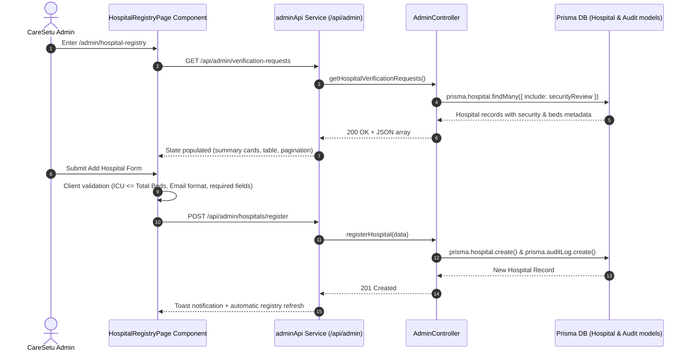

# CareSetu Admin Hospital Registry — UI/UX & Interaction Documentation

## 1. Overview
The **CareSetu Admin Hospital Registry Module** (`/admin/hospital-registry`) provides complete lifecycle management for hospital facilities within the CareSetu platform. It enables administrators to register new facilities with inline data validation, monitor facility capacity and status, filter and search facility records, review pending verification requests, and inspect security review statuses.

---

## 2. Technical Architecture & Data Flow

---

## 3. UI/UX & Component Structure

### 3.1 Page Header
- **Title:** `Hospital Registry`
- **Subtitle:** `Register, verify, monitor, and manage CareSetu hospital facilities.`
- **Header Actions:**
  - `Last updated: relative timestamp` (e.g. `Just now`, `5 mins ago`)
  - **Refresh Button (`[Refresh]`):** Triggers `refreshRegistry()`, displays spinning loading icon while active, disables button during fetch to prevent duplicate requests.

### 3.2 Clickable Summary Stat Cards
Four interactive cards aggregate real backend facility counts:
1. **Total Hospitals:** Sets `statusFilter = 'all'`, `securityFilter = 'all'`
2. **Pending Verification:** Sets `statusFilter = 'pending'`, `securityFilter = 'all'`
3. **Approved Facilities:** Sets `statusFilter = 'approved'`, `securityFilter = 'all'`
4. **Temporarily Blocked:** Sets `securityFilter = 'blocked'`, `statusFilter = 'all'`

Selected summary cards feature a blue primary border and ring highlighting active filter context.

### 3.3 Add Hospital Form & Validation Rules
The expandable/collapsible **Add Facility** card enforces inline field-level validation:
- **Facility Name:** Required (non-empty)
- **Official Email:** Must match standard email regex (`^[^\s@]+@[^\s@]+\.[^\s@]+$`)
- **Contact Number:** Required
- **Hospital Type:** Dropdown selection (`Government`, `Private`, `Trust / NGO`, `Other`)
- **Ownership:** Dropdown selection (`Government`, `Private`)
- **Registration / License ID:** Required unique identifier
- **Location Fields:** State, District, City, Full Address
- **Coordinates:** Optional numeric Latitude (-90 to 90) and Longitude (-180 to 180)
- **Beds Validation:** Total Beds >= 0, ICU Beds >= 0, **ICU Beds cannot exceed Total Beds**.
- **Emergency Availability:** Toggle checkbox (`Yes` / `No`)

Errors display below the affected input field in red text without using `window.alert()`.

### 3.4 Search, Multi-Attribute Filtering & Sorting
- **Debounced Search:** Searches across Facility Name, Registration ID, Email, City, and District with a 300ms debounce. Includes an inline clear `X` button.
- **Filters Grid:**
  - **Verification Status:** All, Pending, Approved, Rejected
  - **Security Status:** All, Active, Under Review, Temporarily Blocked
  - **Hospital Type:** All, Government, Private, Trust / NGO, Other
  - **Ownership:** All, Government, Private
- **Sort Options:** Newest First, Oldest First, Facility Name A-Z, Facility Name Z-A, Total Beds (High -> Low), Total Beds (Low -> High).
- **Clear All Filters (`[Clear All Filters]`):** Resets search string, all 4 filter dropdowns, and sort order to defaults.
- **Zero-State Fallback:** When filters yield 0 results, a clean empty state card appears with a direct `Clear All Filters` button.

### 3.5 Action Handlers & Dialog Workflows
1. **View Details Drawer/Modal:** Displays comprehensive metadata (Contact, Location, Lat/Lng, Beds, Security Status, Verification Status, Audit history) without exposing patient PHI or private HealthPack content. Esc key closes modal.
2. **Approve Confirmation Dialog:** Prompts user to confirm approval. Calls `PUT /api/admin/verify-hospital/:id` with `{ status: 'approved' }`, updates audit trail, refreshes summary counters and table rows immediately.
3. **Reject Reason Dialog:** Requires non-empty reason text. Submits `{ status: 'rejected', rejectionReason: '...' }`, notifies admin via toast, refreshes state.
4. **Security Review Integration:** Blocked facilities (`TEMPORARILY_BLOCKED`) display a `View Security Review` button navigating to `/admin/security-reviews?hospitalId=...`.

---

## 4. Accessibility & Responsive Support

- **Keyboard Navigation:** Full focus ring support, `Tab` order on form fields, and `Escape` key handlers for all active modals/drawers.
- **Motion Reduction:** Utilizes Tailwind `motion-reduce:transition-none` for users with `prefers-reduced-motion: reduce`.
- **Responsive Layouts:**
  - Mobile (<640px): Summary cards in 1-column stack, form in single-column layout, table in horizontally scrollable wrapper.
  - Tablet (768px - 1024px): 2-column card grid, responsive inputs.
  - Desktop (>1024px): 4-column summary grid, full multi-attribute filter bar.

---

## 5. Security & RBAC Enforcement

- All registry routes (`/api/admin/hospitals/*`, `/api/admin/verify-hospital/*`) require valid JWT authentication and `ADMIN` role scope.
- Actions create immutable audit logs in `prisma.auditLog`.
- Unlocking blocked facilities remains authoritatively bound to the **Security Reviews module** (`/admin/security-reviews`).

---

## 6. Verification Evidence

- **Frontend Compilation:** `tsc -b && vite build` succeeded in **11.62s** with **0 TypeScript/JSX errors**.
- **Backend Verification:** Admin controller routes successfully validated against PostgreSQL/Prisma schemas.
