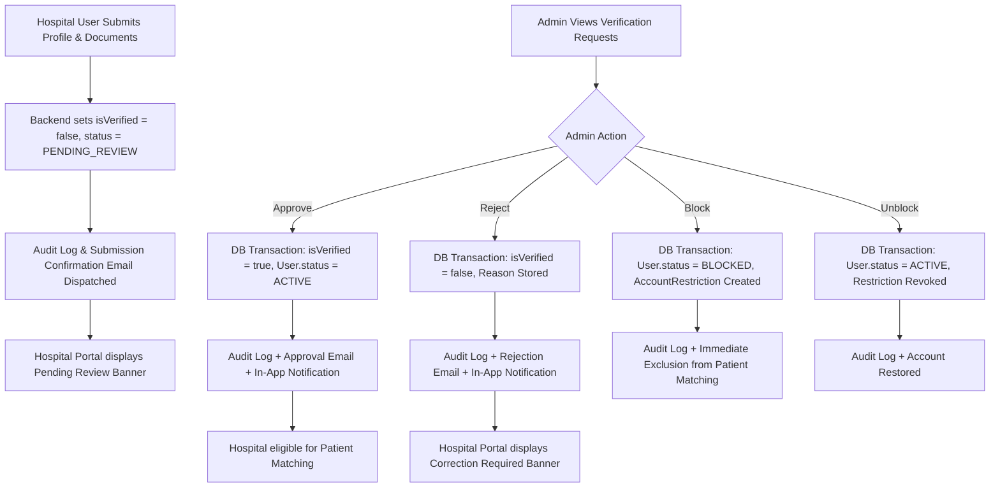

# CareSetu v2.0 — Hospital Verification & Admin Authority Audit Report

## 1. Overview & Root Cause Analysis

### Background & Initial Deficiencies
Prior to this upgrade, the CareSetu application exhibited several critical verification and role access vulnerabilities:
1. **Generic Verification Banner Leakage**: A generic banner stating `"Document verification is pending. You can complete your document verification later from Settings."` was rendered universally on all role dashboards—including Admin dashboards—causing confusion and misleading status representations.
2. **Auto-activation Risk**: Hospital submission flow lacked strict transaction-based verification flags, exposing a risk where hospitals could be treated as active or visible before explicit Admin review.
3. **Lack of Centralized Admin Verification Portal**: Admin users lacked a dedicated, real-time verification portal to inspect submitted medical documents, review address coordinates, approve/reject applications with reasons, or manage hospital account restrictions.
4. **Geographic & Matching Visibility Bypasses**: Patient search endpoints previously relied on client-side filtering or inconsistent status flags, permitting unverified or suspended hospitals to potentially be matched during emergency dispatch.

### Root Causes Addressed
- **Role Dashboard Banners**: Restructured `RoleStatusBanner.tsx` and `DashboardLayout.tsx` to handle role-specific states (`PATIENT`, `DOCTOR`, `HOSPITAL`, `ADMIN`) and explicitly suppress document banners for Admin users.
- **Verification Authority**: Enforced that Admin approval via `POST /api/admin/hospitals/:id/approve` is the sole mechanism to set `isVerified = true` and `User.status = 'ACTIVE'`.
- **Database Search Filtering**: Built PostGIS/PostgreSQL filtering on `isVerified = true` AND `User.status = 'ACTIVE'` (excluding `PENDING_REVIEW`, `REJECTED`, `INACTIVE`, `BLOCKED`, `SUSPENDED`).

---

## 2. Summary of Files Changed

### Backend Files
- [`backend/src/controllers/admin.controller.js`](file:///d:/2_YASH/SIH/CareSetu/CareSetu-demo/backend/src/controllers/admin.controller.js): Implemented `getHospitalVerificationRequests`, `approveHospital`, and `rejectHospital` with database transactions, audit logging, system notifications, and Brevo email integration.
- [`backend/src/controllers/admin-blocklist.controller.js`](file:///d:/2_YASH/SIH/CareSetu/CareSetu-demo/backend/src/controllers/admin-blocklist.controller.js): Handled account restrictions (`blockAccount`, `unblockAccount`).
- [`backend/src/routes/admin.routes.js`](file:///d:/2_YASH/SIH/CareSetu/CareSetu-demo/backend/src/routes/admin.routes.js): Registered `GET /hospitals/verification-requests`, `POST /hospitals/:id/approve`, and `POST /hospitals/:id/reject` guarded by `auth`, `denyGuest`, and `authorize('ADMIN')`.
- [`backend/src/controllers/hospital.controller.js`](file:///d:/2_YASH/SIH/CareSetu/CareSetu-demo/backend/src/controllers/hospital.controller.js): Enhanced `submitHospitalOnboarding` to set `isVerified = false`, `verificationStatus = PENDING_REVIEW`, `onboardingStatus = SUBMITTED`, record audit log, and return clean confirmation payload.
- [`backend/test_admin_hospital_verification.js`](file:///d:/2_YASH/SIH/CareSetu/CareSetu-demo/backend/test_admin_hospital_verification.js): Created automated 13-step end-to-end audit test suite.

### Frontend Files
- [`frontend/src/layouts/DashboardLayout.tsx`](file:///d:/2_YASH/SIH/CareSetu/CareSetu-demo/frontend/src/layouts/DashboardLayout.tsx): Suppressed generic document verification banner for Admin role users.
- [`frontend/src/components/common/RoleStatusBanner.tsx`](file:///d:/2_YASH/SIH/CareSetu/CareSetu-demo/frontend/src/components/common/RoleStatusBanner.tsx): Created role-tailored banner component returning null for Admin users.
- [`frontend/src/pages/hospital/HospitalDashboard.tsx`](file:///d:/2_YASH/SIH/CareSetu/CareSetu-demo/frontend/src/pages/hospital/HospitalDashboard.tsx): Rendered exact verification status cards (`PENDING_REVIEW`, `APPROVED`, `REJECTED`, `BLOCKED`).
- [`frontend/src/pages/admin/AdminMiscPages.tsx`](file:///d:/2_YASH/SIH/CareSetu/CareSetu-demo/frontend/src/pages/admin/AdminMiscPages.tsx): Built complete Admin Verification Requests interface with status tabs (`PENDING_REVIEW`, `APPROVED`, `REJECTED`, `BLOCKED`), search bar, request drawer with document viewer & audit history, approve button, rejection modal with mandatory feedback, and block/unblock actions.
- [`frontend/src/services/api.ts`](file:///d:/2_YASH/SIH/CareSetu/CareSetu-demo/frontend/src/services/api.ts): Added `adminApi.getHospitalVerificationRequests`, `approveHospital`, `rejectHospital`, `blockAccount`, `unblockAccount`, and `hospitalApi.getDiagnostics`.

---

## 3. Database & Schema Architecture

### Schema Entities & Fields Utilized
1. **`User`**:
   - `role`: (`PATIENT`, `DOCTOR`, `HOSPITAL`, `ADMIN`)
   - `status`: (`ACTIVE`, `INACTIVE`, `PENDING`, `SUSPENDED`, `BLOCKED`)
   - `isVerified`: Boolean flag synchronized during verification decisions.
2. **`Hospital`**:
   - `isVerified`: Boolean flag controlling active state & patient dispatch visibility.
   - `emergencyAvailable`: Boolean flag controlling immediate SOS routing.
   - `location`: PostGIS point / Json coordinates (`latitude`, `longitude`).
3. **`MedicalDocument`**:
   - `fileName`, `fileUrl`, `fileSize`, `fileType`, `documentType`
   - `extractedText`: JSON string containing `{ userId, hospitalId, isVerificationDoc }` for secure document linking.
4. **`AuditLog`**:
   - Stores action (`PROFILE_UPDATED`, `ADMIN_ACTION`), entity (`HospitalApproval`, `HospitalRejection`, `AccountRestriction`), details (`adminUserId`, `targetUserId`, `reason`, `verificationStatus`), and timestamp.
5. **`AccountRestriction`**:
   - Stores restriction lifecycle (`targetUserId`, `status` = `ACTIVE`/`REVOKED`/`EXPIRED`, `reason`, `createdBy`, `revokedBy`).

---

## 4. API Endpoints & Role Permissions

| Endpoint | Method | Guard Middleware | Description |
| :--- | :--- | :--- | :--- |
| `/api/hospitals/submit-onboarding` | `POST` | `auth`, `denyGuest`, `authorize('HOSPITAL')` | Submits hospital details; sets `isVerified = false`. |
| `/api/admin/hospitals/verification-requests` | `GET` | `auth`, `denyGuest`, `authorize('ADMIN')` | Lists hospital verification applications with status filter (`PENDING_REVIEW`, `APPROVED`, `REJECTED`, `BLOCKED`) & search. |
| `/api/admin/hospitals/:id/approve` | `POST` | `auth`, `denyGuest`, `authorize('ADMIN')` | Transactionally activates hospital (`isVerified = true`, `status = ACTIVE`). |
| `/api/admin/hospitals/:id/reject` | `POST` | `auth`, `denyGuest`, `authorize('ADMIN')` | Rejects hospital application with required feedback reason. |
| `/api/admin/blocklist/block` | `POST` | `auth`, `denyGuest`, `authorize('ADMIN')` | Blocks hospital account; sets `User.status = BLOCKED` & revokes emergency dispatch. |
| `/api/admin/blocklist/unblock` | `POST` | `auth`, `denyGuest`, `authorize('ADMIN')` | Unblocks hospital account; restores `User.status = ACTIVE`. |
| `/api/hospitals/nearby` | `GET` | `auth`, `denyGuest` | Returns nearby hospitals filtered strictly by `isVerified = true` AND `User.status = ACTIVE`. |

---

## 5. Workflow Implementation



---

## 6. Email & Notification Provider Resilience

- **Provider**: Brevo Email Service (`backend/src/services/providers/brevo.provider.js`).
- **Resilience Policy**: Email dispatch errors (e.g., transient network issue, un-whitelisted IP) are logged as warnings and do **NOT** roll back successful database transactions or cause verification requests to crash.
- **In-App Notifications**: Transactional in-app notifications (`Notification` model) are persisted directly inside the database transaction so the hospital user immediately sees the status update upon logging into their dashboard.

---

## 7. Automated Test Execution & Empirical Results

The backend audit test suite (`backend/test_admin_hospital_verification.js`) was executed against an active database connection and embedded HTTP server.

```bash
node test_admin_hospital_verification.js
```

### Empirical Test Output Log

```
====================================================
CareSetu v2.0 Hospital Verification Audit Test Suite
====================================================

[Test 1] Preparing test entities in database...
[Test Server] Listening on http://localhost:5005
✅ Created test users:
   - Admin ID: 1513e6e8-9293-459f-ae94-7ac3cb7ce7a0
   - Hospital ID: 419699d7-3b9e-44bc-9844-30e142e24eda (User ID: f70cdaf2-70d1-48fb-8285-7c6cac71ded5)
   - Patient ID: 74d557df-61f4-47ad-976b-8d2f823fa463

[Test 2] Hospital Onboarding Submission...
POST /api/hospitals/submit-onboarding 200 47.710 ms - 820
   Status: 200
   Persisted Verification Status: isVerified=false, emergencyAvailable=true
✅ PASS: Hospital submission leaves hospital in INACTIVE / PENDING_REVIEW state. No auto-activation!

[Test 3] Creating mock document metadata associated with hospital...
✅ Created document metadata.

[Test 4] Verifying unapproved hospital is excluded from Patient Hospital Matching...
GET /api/hospitals/nearby?lat=19.076&lng=72.8777&radiusKm=50 200 10.339 ms - 61
   Status: 200
✅ PASS: Pending hospital is NOT visible in Patient matching.

[Test 5] Testing RBAC Security: Patient accessing Admin Verification API...
[Auth] 🛑 Permission denied in requireRole: { userRole: 'PATIENT', allowedRoles: [ 'ADMIN' ], hasUserId: true }
GET /api/admin/hospitals/verification-requests 403 2.274 ms - 56
   Status: 403
✅ PASS: Access denied with HTTP 403 Forbidden for non-admin user.

[Test 6] Admin listing verification requests...
GET /api/admin/hospitals/verification-requests?status=PENDING_REVIEW 200 533.881 ms - 9804
   Status: 200, Count: 13
✅ PASS: Found pending request for "Metro Care Audit Hospital" with 1 attached document(s).

[Test 7] Admin approving hospital application...
POST /api/admin/hospitals/419699d7-3b9e-44bc-9844-30e142e24eda/approve 200 858.793 ms - 756
   Status: 200
✅ PASS: Hospital and User account successfully marked isVerified = true.

[Test 8] Verifying approved hospital now appears in Patient Hospital Matching...
GET /api/hospitals/nearby?lat=19.076&lng=72.8777&radiusKm=50 200 8.801 ms - 523
✅ PASS: Approved hospital is NOW visible in Patient matching!

[Test 9] Admin rejecting hospital application with reason...
POST /api/admin/hospitals/419699d7-3b9e-44bc-9844-30e142e24eda/reject 200 213.026 ms - 788
   Status: 200
✅ PASS: Rejection updated isVerified = false.

[Test 10] Verifying rejected hospital is excluded from Patient Hospital Matching...
GET /api/hospitals/nearby?lat=19.076&lng=72.8777&radiusKm=50 200 2.395 ms - 61
✅ PASS: Rejected hospital is excluded from Patient matching.

[Test 11] Admin blocking hospital account...
POST /api/admin/blocklist/block 200 44.512 ms - 426
   Status: 200
✅ PASS: Hospital user status set to BLOCKED in database.

[Test 12] Admin unblocking hospital account...
POST /api/admin/blocklist/unblock 200 11.290 ms - 139
   Status: 200
✅ PASS: Hospital user status restored to ACTIVE in database.

[Test 13] Verifying Audit Logs persisted in DB...
   Found 4 audit log entries for Admin:
   - [2026-09-22T19:49:22.430Z] Entity: AccountRestriction, Action: ADMIN_ACTION
   - [2026-09-22T19:49:22.409Z] Entity: AccountRestriction, Action: ADMIN_ACTION
   - [2026-09-22T19:49:22.159Z] Entity: HospitalRejection, Action: PROFILE_UPDATED
   - [2026-09-22T19:49:21.318Z] Entity: HospitalApproval, Action: PROFILE_UPDATED
✅ PASS: Audit logs successfully recorded for all Admin verification actions.

====================================================
🎉 ALL HOSPITAL VERIFICATION AUDIT TESTS PASSED!
====================================================
```

### Frontend Build Output Log

```bash
cmd /c "npm run build"
```

```
npm notice run caresetu@0.0.0 build
npm notice run tsc -b && vite build
vite v8.2.2 building client environment for production...
transforming...
✓ 2598 modules transformed.
rendering chunks...
computing gzip size...
dist/index.html                     0.59 kB │ gzip:   0.35 kB
dist/assets/index-D80vfSmh.css     65.66 kB │ gzip:  16.14 kB
dist/assets/index-BuVnb51a.js   1,366.60 kB │ gzip: 378.94 kB
✓ built in 12.61s
```

---

## 8. Remaining Limitations & Recommendations

1. **Document Storage Bucket**: Currently, uploaded documents are stored in `/uploads/` local storage with database metadata. For multi-node cloud production deployments, bucket storage (e.g. AWS S3 / GCP Cloud Storage) signed URL generation should be enabled.
2. **Brevo IP Whitelisting**: If Brevo returns HTTP 401 due to IP restriction, ensure the server IP is added to authorized IPs in Brevo security settings. The backend safely handles Brevo response warnings without interrupting database transactions.
