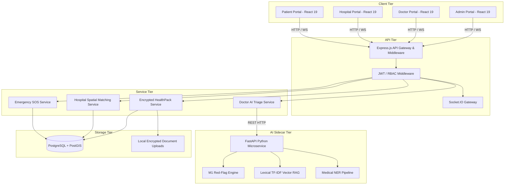

# CareSetu Technical Architecture Specification

## 1. Executive Summary

CareSetu is a modern micro-monolith designed for healthcare orchestration, emergency dispatching, and AI-assisted patient triage. The system is split into three main layers:
1. **Presentation Layer:** React 19 SPA with TailwindCSS, Lucide React, Leaflet Maps, and Socket.IO client.
2. **Application & Orchestration Layer:** Node.js Express server handling authentication, business logic, WebSocket dispatch, and database persistence.
3. **AI Inference Layer:** Python FastAPI sidecar running local Medical NLP/NER, TF-IDF RAG retrieval, and red-flag emergency classification.

---

## 2. High-Level Architecture Diagram

---

## 3. Data Flow & Security Boundaries

### Emergency SOS Flow
1. Patient clicks "Trigger SOS".
2. Client acquires navigator geolocation coordinates (`latitude`, `longitude`).
3. Client posts `POST /api/emergency/sos`.
4. Backend executes PostGIS query finding active hospitals within 10km radius.
5. Socket.IO emits `sos:new_broadcast` event to candidate hospital dashboards.
6. First hospital accepting the dispatch triggers `sos:accepted` to patient UI and triggers SMS to emergency contacts via TextBee.

### Doctor AI Flow
1. Patient submits text query or document attachment to `POST /api/chat/message`.
2. Backend checks query against `RedFlagService` (deterministic emergency check).
3. If Red Flag detected -> short-circuits to `isEmergency: true`, returns SOS prompt.
4. If no Red Flag -> executes TF-IDF lexical search over `medical-knowledge.json`.
5. Attaches isolated patient HealthPack context (if permitted by patient).
6. Constructs structured 5-part clinical response and persists chat in PostgreSQL.
