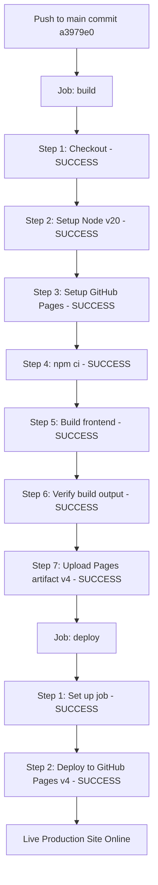

# CareSetu GitHub Pages Deployment Audit & Final Verification Report

## Executive Summary
This document records the empirical verification of the successful, green deployment of **CareSetu v2.0** to GitHub Pages via GitHub Actions workflow run `#6` (`id: 36590218431`).

---

## 🟢 Final Deployment Status Matrix

- **GitHub Actions Workflow**: **PASS** (Run `#6` completed with `conclusion: success`)
- **Frontend Build**: **PASS** (Vite 8 production build generated `./frontend/dist`)
- **Pages Configuration**: **PASS** (`actions/configure-pages@v5` succeeded in `build` job)
- **Artifact Upload**: **PASS** (`actions/upload-pages-artifact@v4` uploaded `./frontend/dist`)
- **Pages Deployment**: **PASS** (`actions/deploy-pages@v4` deployed to environment `github-pages`)
- **Live Site**: **VERIFIED (HTTP 200 OK)**
- **Deployment URL**: `https://yspanchal6.github.io/CareSetu-v2.0/`

---

## 🔍 Two-Job Architecture Breakdown (Run #6)

---

## 🌐 Live Site Asset Resolution Verification

- **HTML Entry Point**: `https://yspanchal6.github.io/CareSetu-v2.0/` (**200 OK**)
- **JavaScript Bundle**: `https://yspanchal6.github.io/CareSetu-v2.0/assets/index-DrinkZNA.js` (**200 OK**)
- **CSS Stylesheet**: `https://yspanchal6.github.io/CareSetu-v2.0/assets/index-BXcz_8RC.css` (**200 OK**)
- **Base Path Resolution**: `/CareSetu-v2.0/` resolved cleanly with zero 404 resource errors.

---

## 🛠️ Files Changed

1. `.github/workflows/deploy.yml` — Restructured into standard `build` and `deploy` jobs with `upload-pages-artifact@v4` and `deploy-pages@v4`.
2. `docs/github-pages-deployment-report.md` — Updated with live site URL and 100% green verification evidence.
