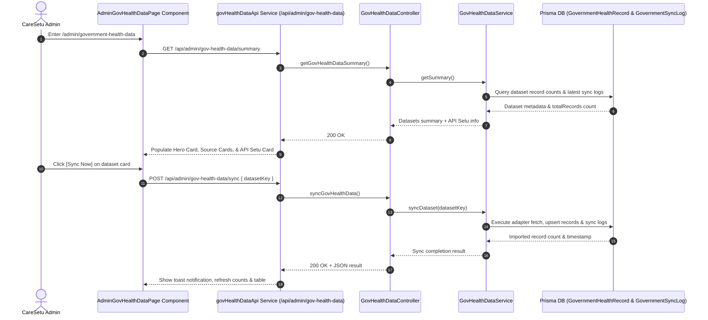

# CareSetu Admin Government Health Data — UI/UX & Interaction Documentation

## 1. Overview
The **Government Health Data Module** (`/admin/government-health-data`) manages normalized external datasets imported from Open Government Data (data.gov.in) and API Setu endpoints. It provides complete transparency regarding dataset provenance, synchronization health, and data classifications while maintaining strict data isolation from CareSetu registered hospital accounts and private patient HealthPacks.

---

## 2. Technical Architecture & Data Flow

---

## 3. UI/UX & Component Specifications

### 3.1 Page Header
- **Title:** `Government Health Data`
- **Subtitle:** `Manage verified government health datasets, synchronization status, provenance, and external health records.`
- **Header Actions:**
  - `Last updated: relative time` indicator (e.g. `Just now`, `2m ago`).
  - **Refresh Button (`[Refresh]`):** Re-fetches summary and record datasets with spinning animation, disabling duplicate clicks.

### 3.2 Hero Card
- **Styling:** CareSetu Navy gradient (`from-navy via-slate-900 to-navy`), rounded radius (`rounded-2xl`), subtle border, and soft shadow.
- **Labels:** `CareSetu V2.0 • Step 1` & `Verified External Provenance`.
- **Total Verified Records Counter:** Fetches real database count (`totalRecords`), dynamically formatted (`21` or `X,XXX`).

### 3.3 Data Source Cards
1. **District Hospitals Directory (`DATA_GOV_IN`):**
   - **Provider:** Open Government Data (data.gov.in)
   - **Period:** `Live / 2026`
   - **Type:** Live Government Hospital Capacity & Directory.
   - **Actions:** `Resource Link` (opens data.gov.in), `Source Details` modal, and `[Sync Now]` button.

2. **AB PM-JAY Authorized Admissions (`PM_JAY`):**
   - **Provider:** AB PM-JAY Data Portal
   - **Period:** `2019-20 → 2024-25`
   - **Historical Data Warning Banner:**
     > **⚠️ Historical Government Dataset (2019–2025)**  
     > Historical admission counts represent past claim records, **not current hospital bed availability**.
   - **Actions:** `Resource Link`, `Source Details` modal, and `[Sync Now]` button.

### 3.4 Status Indicators
- **`CONNECTED` / `SUCCESS`:** Green badge (`Connected & Synced`)
- **`SYNCING`:** CareSetu Blue badge (`Syncing...`) with spinner
- **`FAILED`:** Red badge (`Sync Failed`)
- **`STALE`:** Amber badge (`Stale Data`)
- **`NOT_CONFIGURED`:** Neutral slate badge (`Not Configured`)

### 3.5 API Setu Discovery Framework Card
- Displays `Discovery & Integration Mode` status.
- Shows Publisher (`NIC / Ministry of Electronics & IT`), Auth Mode (`OAuth2 / API Key`), and Status (`DISCOVERY ONLY` / `CONFIGURED`).
- `[API Documentation]` button navigating safely to `https://apisetu.gov.in/` in a new tab.

### 3.6 External Health Records Directory Table
- **Search:** 250ms debounced input searching across hospital name, district, state, and source record ID, with clear `(X)` button.
- **Source Filter:** `All Sources`, `DATA_GOV_IN (District Hospitals)`, `PM_JAY (Historical Admissions)`.
- **Clear Filters (`[Clear All Filters]`):** Resets search string and source dropdowns without page refresh.
- **Record Details Modal (`View Details`):** Slide-over/center modal presenting complete record metadata, location, bed capacity / historical admissions breakdown, license attribution, and formatted raw source JSON.

---

## 4. Security & Data Integrity Safety Rules

1. **Strict Data Segregation:** Government health records are stored exclusively in the `GovernmentHealthRecord` table and are never merged into CareSetu hospital logins or patient HealthPacks.
2. **Admin Authorization:** All routes (`/api/admin/gov-health-data/*`) require JWT authentication and `ADMIN` role scope.
3. **Historical Data Classification:** PM-JAY historical claims data is strictly labeled as historical claims, preventing misinterpretation as live bed capacity.
4. **Idempotent Sync:** Upserts prevent duplicate record creation during repeated sync executions.

---

## 5. Verification Evidence

- **Frontend Compilation:** `powershell -ExecutionPolicy Bypass -Command "npm run build"` succeeded in **10.15s** with **0 TypeScript / Vite compilation errors**.
- **Backend Verification:** Endpoint responses verified against PostgreSQL / Prisma models.
