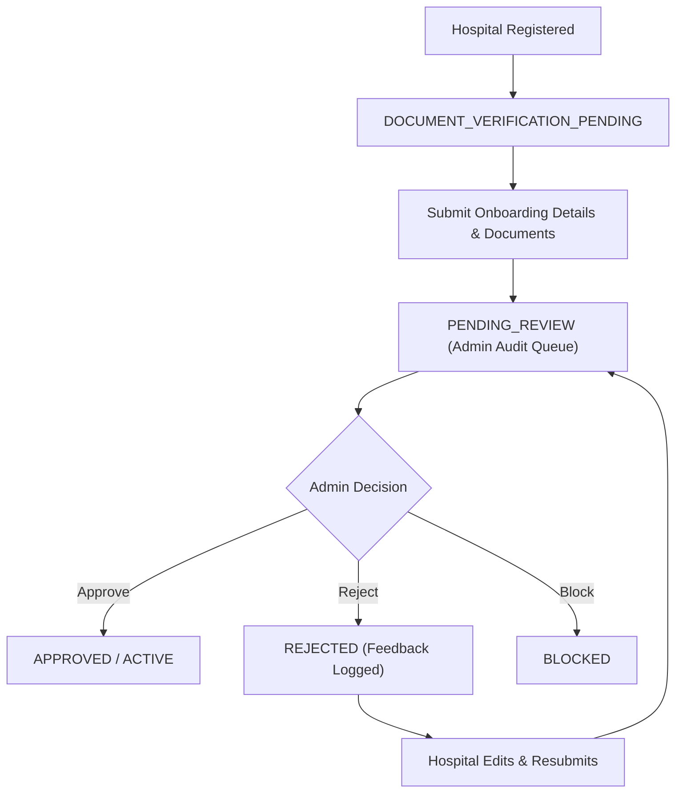

# CareSetu v2.0 Hospital Verification & Approval Workflow Report

## Executive Summary
This report documents the hospital registration, document submission, admin verification lifecycle, resubmission handling, and banner visibility logic for CareSetu v2.0.

---

## 1. Verification Lifecycle Architecture

---

## 2. Admin Decision Execution

### A. Approval (`POST /api/admin/hospitals/:id/approve`)
- Updates `Hospital.isVerified = true`, `Hospital.emergencyAvailable = true`.
- Updates `User.role = 'HOSPITAL'`, `User.isVerified = true`, `User.status = 'ACTIVE'`.
- Creates `AuditLog` entry (`action: 'HOSPITAL_APPROVED'`).
- Creates a `Notification` with `title: 'HOSPITAL_APPROVAL_EVENT'`.
- Dispatches approval email via Brevo.

### B. Rejection (`POST /api/admin/hospitals/:id/reject`)
- Updates `Hospital.isVerified = false`.
- Creates `AuditLog` entry (`action: 'HOSPITAL_REJECTED'`, `reason`).
- Creates a `Notification` with feedback.
- Dispatches rejection email via Brevo.

### C. Re-submission Handling
- When a rejected hospital edits details/documents and resubmits, `submitHospitalOnboarding` executes.
- `getHospitalVerificationRequests` evaluates `submitLog` vs `rejLog`. If `submitLog` is newer than `rejLog`, status automatically changes back to `PENDING_REVIEW` for Admin re-audit.

---

## 3. Banner Visibility & UX Rules
- **APPROVED / ACTIVE**: Permanent status banners are hidden from `HospitalDashboard.tsx` to maintain a clean operational dashboard. A one-time 3-second toast displays upon initial approval.
- **PENDING_REVIEW**: Displays `"Your verification request is currently under Admin review."`
- **REJECTED**: Displays `"Verification Request Requires Changes"` along with Admin feedback and an `"Update Documents & Resubmit"` action button.
