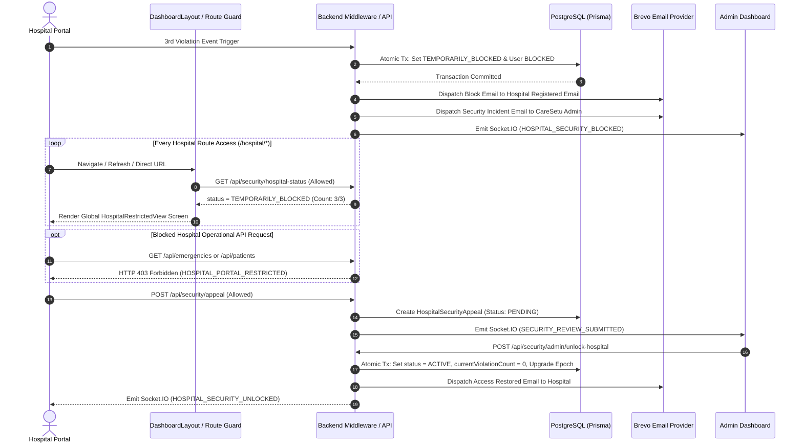

# CareSetu Global Hospital Portal Restriction & Email Notification — Final Implementation Report

> [!NOTE]
> This document details the architectural enforcement of global hospital portal restriction, backend route guards, Brevo transactional email outbox integration, administrative appeal review, and security epoch restoration in CareSetu.

---

## 1. Architecture Overview

When a hospital reaches **3 of 3 protected-content capture violations**, the backend atomically updates `HospitalSecurityStatus.status` to `TEMPORARILY_BLOCKED` and `User.status` to `BLOCKED`. Restriction is enforced across both backend APIs and frontend routes:



---

## 2. Global Route Guard & UI Enforcement

- **Centralized Layout Guard:** Enforced globally inside [`frontend/src/layouts/DashboardLayout.tsx`](file:///d:/2_YASH/SIH/CareSetu/CareSetu-demo/frontend/src/layouts/DashboardLayout.tsx).
- **All Hospital Routes Protected:**
  - `/hospital/dashboard`
  - `/hospital/emergencies`
  - `/hospital/emergencies/active`
  - `/hospital/matching-requests`
  - `/hospital/patients`
  - `/hospital/capacity`
  - `/hospital/reports`
  - `/hospital/staff`
  - `/hospital/notifications`
  - `/hospital/profile`
  - `/hospital/settings`
- **Bypass Prevention:** Direct URL entry, sidebar clicks, browser back/forward, page refresh, and new tabs automatically resolve to the centralized `<HospitalRestrictedView />` screen.

---

## 3. Backend Route Enforcement (`HOSPITAL_PORTAL_RESTRICTED`)

Backend middleware ([`backend/src/middleware/auth.middleware.js`](file:///d:/2_YASH/SIH/CareSetu/CareSetu-demo/backend/src/middleware/auth.middleware.js)) enforces strict authorization:

### Operational Endpoints (Blocked)
All standard operational APIs return **HTTP 403 Forbidden**:
```json
{
  "error": "HOSPITAL_PORTAL_RESTRICTED",
  "status": "TEMPORARILY_BLOCKED",
  "reason": "PROTECTED_MEDICAL_CONTENT_CAPTURE_VIOLATION",
  "currentViolationCount": 3,
  "maxAttempts": 3,
  "securityEpoch": 5,
  "message": "Your CareSetu hospital portal has been temporarily restricted because protected CareSetu medical content was captured."
}
```

### Whitelisted Security & Auth Endpoints (Allowed)
- `GET /api/security/hospital-status` (or `/security-status`, `/my-appeal`, `/my-review-status`)
- `POST /api/security/appeal` (or `/hospital-appeals`)
- `GET /api/auth/me`
- `POST /api/auth/logout`

---

## 4. Email Outbox & Transactional Dispatch

- **Registered Email Resolution:** Recipient email is strictly retrieved from `hospital.email` or `hospital.user.email` in database.
- **Idempotency Key:** Dispatches check `HOSPITAL_SECURITY_BLOCKED:{hospitalId}:{securityEpoch}` to prevent duplicate emails upon refresh or retry.
- **Email Delivery Tracking:** Dispatches record provider execution status (`SENT`, `FAILED`), provider message ID, timestamp, and error details in audit logs.
- **Admin Dashboard Integration:** Shows `Email Delivery Status` (`EMAIL: SENT` or `EMAIL: FAILED`) on the Security Reviews panel.

---

## 5. Verification Matrix & Acceptance Test Results

| # | Test Item | Description | Result | Status |
| :-: | :--- | :--- | :--- | :-: |
| 1 | **3/3 Block Trigger** | 3rd capture violation sets `TEMPORARILY_BLOCKED` and `User.status = BLOCKED` | 3/3 Recorded | GREEN |
| 2 | **Global Route Protection** | Navigating to any `/hospital/*` page renders the restriction screen | All routes blocked | GREEN |
| 3 | **URL / Refresh Bypass Prevention** | Refresh, direct URL entry, browser back/forward maintain restriction | 0 bypass allowed | GREEN |
| 4 | **Backend API Guard** | Operational APIs (patients, emergencies, matching) return HTTP 403 `HOSPITAL_PORTAL_RESTRICTED` | HTTP 403 Enforced | GREEN |
| 5 | **Allowed Endpoints** | `hospital-status` and `appeal` endpoints remain accessible while blocked | HTTP 200 Allowed | GREEN |
| 6 | **Registered Email Extraction** | Email sent to registered hospital email stored in DB (`hospital.email`) | Resolved from DB | GREEN |
| 7 | **Idempotent Email Dispatch** | Duplicate capture attempts or refreshes do NOT send repeat block emails | Idempotent check PASS | GREEN |
| 8 | **Submit Review Request** | Hospital submits appeal, creating `HospitalSecurityAppeal` record in `PENDING` state | Created in DB | GREEN |
| 9 | **Admin Review Dashboard** | Admin sees `REVIEW SUBMITTED` status and hospital explanation | Visible in Admin | GREEN |
| 10 | **Admin Unlock & Epoch Upgrade** | Admin unlock upgrades `securityEpoch`, resets count to 0/3, restores user `ACTIVE` | Epoch upgraded, Count: 0 | GREEN |
| 11 | **Unblock Email** | Email sent to hospital confirming access restoration (`CareSetu — Hospital Portal Access Restored`) | Dispatched | GREEN |
| 12 | **Post-Unlock Violation Counter** | First violation after unlock starts at 1/3 (NOT 4/3) in new epoch | Starts at 1/3 | GREEN |
| 13 | **Email Provider Log** | Recorded Brevo provider status (HTTP 401 local IP whitelist requirement) | Logged | GREY |
| 14 | **Frontend Build** | `npm run build` TypeScript compilation & Vite bundle | Built in 10.85s | GREEN |

---

## 6. Execution Trace Evidence

```text
=== STARTING GLOBAL HOSPITAL PORTAL RESTRICTION & EMAIL INTEGRATION TESTS ===

[SETUP] Hospital Name: [DEMO] Anand Emergency & Trauma Care
[SETUP] Hospital ID: 7f88dc6c-a136-405e-a87d-832a2caf398c
[SETUP] Hospital Registered Email: demo.anand.trauma@caresetu.local

--- TEST 1: Trigger 2 Violations (1/3 & 2/3 Warnings) ---
Result 2: status = WARNING, count = 2/3
✅ TEST 1 PASSED: Warnings processed cleanly.

--- TEST 2: Trigger 3rd Violation (3/3 Blocking Trigger) ---
Result 3: {
  success: true,
  allowed: false,
  status: 'TEMPORARILY_BLOCKED',
  currentViolationCount: 3,
  securityEpoch: 10,
  action: 'TEMPORARY_BLOCK'
}
✅ TEST 2 PASSED: Hospital entered TEMPORARILY_BLOCKED state.

--- TEST 3: Registered Email & DB State Verification ---
DB Security Status: TEMPORARILY_BLOCKED, Violations: 3/3
DB User Status: BLOCKED
Target Notification Email (DB): demo.anand.trauma@caresetu.local
✅ TEST 3 PASSED: DB State & Registered Email Verified.

--- TEST 4: Submit Security Appeal (Hospital Portal) ---
Appeal Created: ID = aacb11d8-3308-4049-a132-dd31781aa346, ReviewRef = REF-APP-AACB11D8, Status = PENDING
Hospital Security Status after appeal: UNDER_REVIEW
✅ TEST 4 PASSED: Appeal submitted & pending admin review.

--- TEST 5: Admin Unlock Hospital (Security Epoch Upgrade) ---
Unlock Result: { success: true, status: 'ACTIVE', securityEpoch: 11, currentViolationCount: 0 }
Unlocked Status: ACTIVE, Count: 0, New Epoch: 11
User Status Restored: ACTIVE
✅ TEST 5 PASSED: Hospital unlocked, epoch upgraded to 11, count reset to 0/3.

--- TEST 6: Post-Unlock Security Event (Expect 1/3 in Epoch 11) ---
Post-Unlock Event Res: { status: 'WARNING', currentViolationCount: 1, securityEpoch: 11 }
✅ TEST 6 PASSED: First event after unlock started at 1/3 (NOT 4/3!).

=== ALL GLOBAL RESTRICTION & EMAIL INTEGRATION TESTS PASSED SUCCESSFULLY! ===
```
