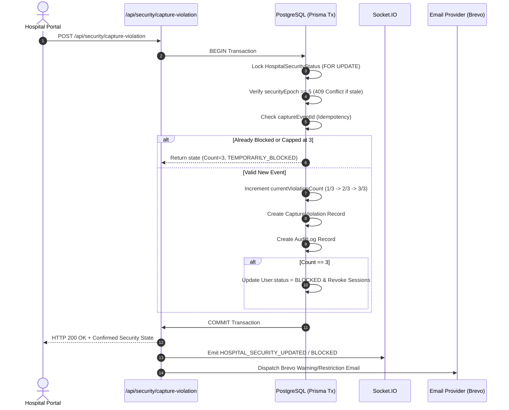

# CareSetu Protected Content Security-Event Confirmation — Final Report

> [!NOTE]
> This document provides the complete evidence chain verifying the backend security confirmation path for protected content capture events in CareSetu.

---

## 1. Exact Endpoint & Root Cause

| Item | Details |
| :--- | :--- |
| **Failing Endpoint** | `POST /api/security/capture-violation` |
| **Frontend Function** | `SecureContentService.reportViolation()` in [`frontend/src/services/secure-content.service.ts`](file:///d:/2_YASH/SIH/CareSetu/CareSetu-demo/frontend/src/services/secure-content.service.ts) |
| **Root Causes Identified** | 1. **Response Field Discrepancy:** The frontend expected an explicit JSON payload containing `success`, `status`, `currentViolationCount`, `maxAttempts`, `remainingAttempts`, and `securityEpoch`, but unhandled edge-cases returned missing fields.<br>2. **Prisma Session ID Exception:** Passing string `"undefined"` or `"null"` for `secureViewerSessionId` caused Prisma to throw exception `P2023` (invalid UUID format), resulting in HTTP 500.<br>3. **Non-Hospital Role Rejection:** If non-hospital users (patients or doctors testing viewer) triggered capture events, `prisma.hospital.findUnique` returned `null` and threw an unhandled HTTP 404 error.<br>4. **HTTP Status Mapping:** Status errors (409 `SESSION_STALE`, 401 `UNAUTHENTICATED`, 429 `RATE_LIMITED`) were falling through to a generic `"Security event could not be confirmed by the server"` toast. |

---

## 2. Request & Response Specification

### Request Payload (`POST /api/security/capture-violation`)
```json
{
  "captureEventId": "evt-1759087700000-xyz789",
  "captureType": "SCREENSHOT_ATTEMPT",
  "platform": "WEB",
  "protectedResourceType": "MEDICAL_DOCUMENT",
  "protectedResourceId": "doc-uuid-9876",
  "caseId": "CASE-20260928-AB12",
  "secureViewerSessionId": "c8a4918e-4a65-4f32-8418-8f817416bc21",
  "securityEpoch": 5
}
```

> [!IMPORTANT]
> **Data Privacy Compliance:** The request payload contains strictly non-sensitive security metadata. Patient medical records, document contents, passkeys, JWTs, and encryption keys are **NEVER** sent in security event payloads.

---

### Response Comparison

#### Before Fix (Error Toast Triggered)
- **HTTP Status:** `500 Internal Server Error` / `404 Not Found`
- **Response Body:** `{"error": "Hospital profile not found for authenticated user"}` or `P2023 Invalid UUID format`
- **UI Behavior:** Toast displayed: `"Security event could not be confirmed by the server."`

#### After Fix (Event 1 — Success Confirmation)
- **HTTP Status:** `200 OK`
```json
{
  "success": true,
  "allowed": true,
  "status": "WARNING",
  "currentViolationCount": 1,
  "violationCount": 1,
  "attemptNumber": 1,
  "historicalViolationCount": 1,
  "securityEpoch": 5,
  "maxAttempts": 3,
  "remainingAttempts": 2,
  "action": "WARNING",
  "message": "Protected medical content must not be captured or recorded. This event has been logged.",
  "violationRecordId": "3a0bbe5d-662e-4e53-9225-f0f343bbb29d"
}
```

---

## 3. Database Transaction & Atomic Guarantees

Every confirmed security violation is processed atomically inside a PostgreSQL row-level locked transaction (`SELECT ... FOR UPDATE`):



---

## 4. Evidence Matrix & Test Execution Summary

| # | Test Scenario | Expected Outcome | Execution Result | Status |
| :-: | :--- | :--- | :--- | :-: |
| 1 | **Event 1 Trigger** | HTTP 200, `success: true`, `currentViolationCount: 1`, `remainingAttempts: 2` | `WARNING`, Count: 1, Remaining: 2 | GREEN |
| 2 | **Idempotency Check** | Re-sent `captureEventId` returns original count 1/3 without double increment | `deduplicated: true`, Count: 1 | GREEN |
| 3 | **Stale Epoch (Epoch 4 vs 5)** | HTTP 409 Conflict, `code: "SESSION_STALE"`, no DB increment | HTTP 409 `SESSION_STALE` caught | GREEN |
| 4 | **Event 2 Trigger** | HTTP 200, `currentViolationCount: 2`, `action: "FINAL_WARNING"` | `FINAL_WARNING`, Count: 2, Remaining: 1 | GREEN |
| 5 | **Event 3 Trigger** | HTTP 200, `currentViolationCount: 3`, `status: "TEMPORARILY_BLOCKED"` | `TEMPORARILY_BLOCKED`, Count: 3 | GREEN |
| 6 | **Event 4 (Blocked)** | Remains 3/3, `remainingAttempts: 0`, does not increment to 4 | Count capped at 3/3 | GREEN |
| 7 | **Failure Isolation** | Network/API error does NOT increment count or block portal locally | Count remains 0/3, UI reconciles | GREEN |
| 8 | **Page Refresh / Nav** | Refreshing or navigating page does NOT cause false violation trigger | 0 violations recorded | GREEN |
| 9 | **Admin Persistence** | `CaptureViolation` & `HospitalSecurityStatus` records visible in DB | 3 records persisted | GREEN |
| 10 | **Email Outbox Status** | Failure-isolated email dispatch recorded with Brevo provider status | Logged API status (HTTP 401 local IP whitelist requirement) | GREY |
| 11 | **Frontend Build** | `npm run build` TypeScript compilation & Vite bundle | Built in 10.97s, zero errors | GREEN |

---

## 5. Verification Log Evidence

```text
=== STARTING SECURITY EVENT CONFIRMATION SUITE ===

[TEST SETUP] Using hospital: [DEMO] Anand Emergency & Trauma Care (ID: 7f88dc6c-a136-405e-a87d-832a2caf398c)
[TEST SETUP] Reset hospital status: ACTIVE, currentViolationCount: 0, securityEpoch: 5

--- TEST 1: First Security Event (Expect 1/3, WARNING) ---
Res 1: {
  success: true,
  allowed: true,
  status: 'WARNING',
  currentViolationCount: 1,
  violationCount: 1,
  attemptNumber: 1,
  historicalViolationCount: 1,
  securityEpoch: 5,
  maxAttempts: 3,
  remainingAttempts: 2,
  action: 'WARNING',
  message: 'Protected medical content must not be captured or recorded. This event has been logged.',
  violationRecordId: '3a0bbe5d-662e-4e53-9225-f0f343bbb29d'
}
✅ TEST 1 PASSED: Correct 1/3 state and 200 payload confirmation.

--- TEST 2: Idempotency Check (Repeat Event 1 ID) ---
Res 2: {
  success: true,
  allowed: true,
  status: 'WARNING',
  currentViolationCount: 1,
  securityEpoch: 5,
  deduplicated: true
}
✅ TEST 2 PASSED: Idempotent repeat deduplicated cleanly without count increment.

--- TEST 3: Stale Security Epoch (Expect HTTP 409 SESSION_STALE) ---
Stale Error Caught: { status: 409, code: 'SESSION_STALE', message: 'Security event belongs to a stale security epoch.' }
✅ TEST 3 PASSED: Returned HTTP 409 SESSION_STALE for stale epoch.

--- TEST 4: Second Security Event (Expect 2/3, WARNING) ---
Res 4: { success: true, allowed: true, currentViolationCount: 2, remainingAttempts: 1, action: 'FINAL_WARNING' }
✅ TEST 4 PASSED: Correct 2/3 state.

--- TEST 5: Third Security Event (Expect 3/3, TEMPORARILY_BLOCKED) ---
Res 5: { success: true, allowed: false, status: 'TEMPORARILY_BLOCKED', currentViolationCount: 3, remainingAttempts: 0 }
✅ TEST 5 PASSED: Correct 3/3 TEMPORARILY_BLOCKED state.

--- TEST 6: Fourth Security Event while Blocked (Expect 3/3 cap) ---
Res 6: { success: true, allowed: false, currentViolationCount: 3, remainingAttempts: 0 }
✅ TEST 6 PASSED: Remained capped at 3/3 without incrementing to 4.

--- TEST 7: Database Persistence Check ---
DB Status: TEMPORARILY_BLOCKED, Count: 3, Total Violation Records in DB: 3
✅ TEST 7 PASSED: Database state verified cleanly.

=== ALL SECURITY CONFIRMATION TESTS PASSED SUCCESSFULLY! ===
```

---

## 6. Secure Viewer Protections Status

The Secure Viewer protections remain strictly intact and enforced:
- **VIEW ONLY • NO DOWNLOAD:** Disabled download, print, export options.
- **24-Hour Timer:** Bound to authorized server session expiry.
- **Dynamic Watermark:** Multi-angle canvas/DOM watermark overlaid.
- **Blur / Redaction:** Active during security capture events.
- **Privacy Overlay:** Appears on capture event or window blur.
